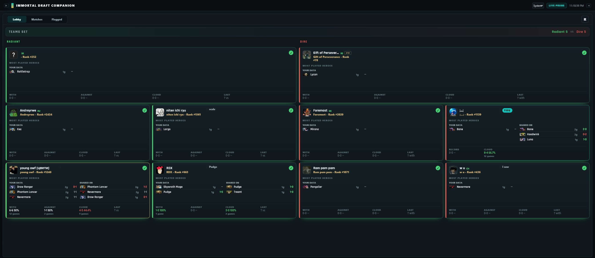
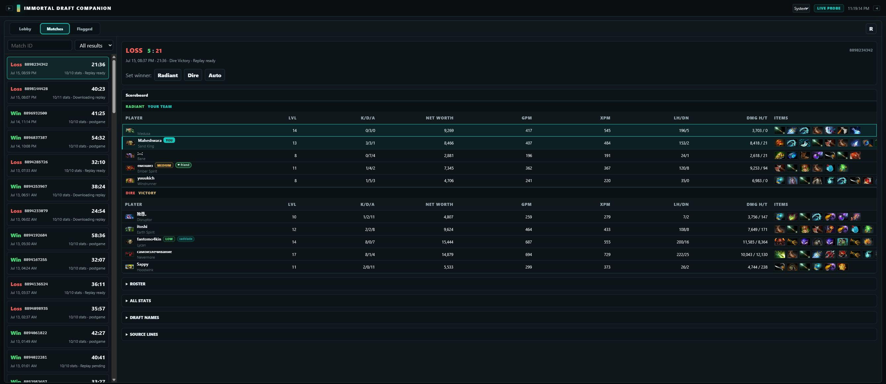

# Dota Lobby Companion

  <strong>Local-first player notes and match intelligence for Dota 2 Immortal Draft.</strong>

  

  
  
  

Dota Lobby Companion turns locally available draft, postgame, and replay data into a searchable history of the players you meet. It keeps personal notes, separates records **with** and **against** each player, and can optionally enrich your history with anonymously shared completed matches.

## Features

- All ten Immortal Draft players with ladder names, teams, notes, risk, aliases, and encounters.
- Local and shared hero records shown separately, so the origin of every statistic stays clear.
- Complete scoreboards with heroes, K/D/A, level, net worth, GPM/XPM, last hits, damage, healing, and item images.
- Searchable match history and dedicated flagged-player view.
- Local capture for high-MMR matches that public match APIs may not expose.
- Offline operation with optional public-name enrichment and shared match lookup.
- English, Russian, and automatic system-language selection.

## Match History

Every completed match links its roster back to the same player profiles used during the draft. Your own row is retained and highlighted, while duplicate scans and uploads are deduplicated by match identity.

## Install

1. Download `DotaCompanion-win-x64.zip` from the [latest release](https://github.com/klimovich008/dota-companion-releases/releases/latest).
2. Extract the archive and run `DotaCompanion.exe`.
3. Leave **Standalone (recommended)** selected and press **Install**.
4. Allow Steam to restart when prompted, then launch Dota normally.

The launcher preserves existing Steam launch options and adds the logging and language options required by the companion. It automatically reapplies the standalone patch after compatible Dota or companion updates.

The default installation requires neither Dota Workshop Tools, Minify, nor a separate Node.js installation. Minify remains available as an optional advanced mode.

## Data And Privacy

Notes, settings, and local match history stay in `%LOCALAPPDATA%\DotaLobbyCompanion` and survive application updates. Shared synchronization is limited to supported completed Immortal Draft matches; personal notes are not uploaded.

The companion observes locally available Dota log, UI, postgame, and replay data. It does not automate player input or make gameplay decisions.

By installing or using the companion, you accept the [software license and match data terms](LICENSE). The tracker does not claim ownership of underlying match facts; submitted data is covered by a non-exclusive license for storage, analysis, and publication.

---

## Русский

Dota Lobby Companion сохраняет заметки об игроках, показывает статистику игр вместе и против них, историю матчей, героев, предметы и данные общей базы для Immortal Draft.

### Установка

1. Скачайте `DotaCompanion-win-x64.zip` из [последнего релиза](https://github.com/klimovich008/dota-companion-releases/releases/latest).
2. Распакуйте архив и запустите `DotaCompanion.exe`.
3. Оставьте режим **Standalone (рекомендуется)** и нажмите **Install**.
4. Разрешите перезапуск Steam и запустите Dota обычным способом.

Workshop Tools и Minify для стандартной установки не нужны. Язык приложения и локальной панели можно переключить между системным, английским и русским.
